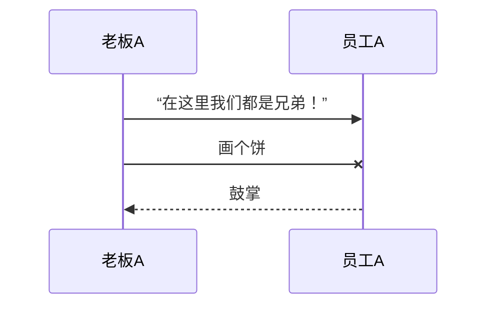

时序图

```mermaid
sequenceDiagram
    participant 老板A
    participant 员工A

    老板A ->> 员工A : “在这里我们都是兄弟！”
    老板A -x 员工A : 画个饼
    员工A -->> 老板A : 鼓掌
```

##### 语法：

消息语句格式为：`<参与者> <箭头> <参与者> : <描述文本>`。

其中 `<箭头>`的写法有：

`->>` 显示为实线箭头（主动发出消息）

`-->>`显示为虚线箭头（响应）

`-x`显示为末尾带「X」的实线箭头（异步消息）