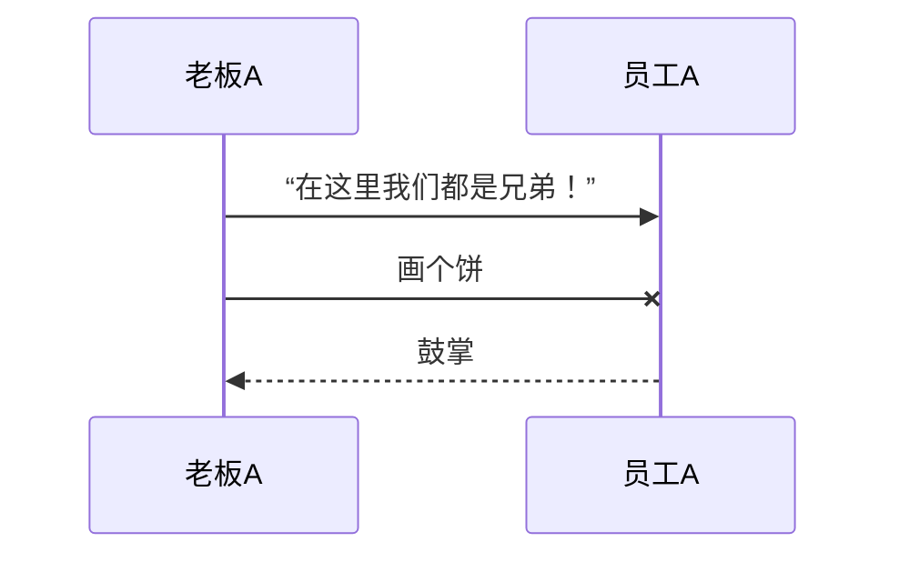

时序图





##### 语法：

消息语句格式为：`<参与者> <箭头> <参与者> : <描述文本>`。

其中 `<箭头>`的写法有：

`->>` 显示为实线箭头（主动发出消息）

`-->>`显示为虚线箭头（响应）

`-x`显示为末尾带「X」的实线箭头（异步消息）


### 2.2.4 puml 案例学习 

```puml
participant springboot
participant netty
control akka
database mongdb

autonumber

springboot->netty: 注册netty
group netty初始化
netty -> netty
activate netty
netty --> netty: 启动 ServerBootstrap
netty --> netty: GatewayInitializer 类注册处理器 ChannelHandler
netty --> netty: netty消息处理url请求，处理自定义路径HttpRouter
netty --> netty: 匹配路由地址处理不同请求
netty -> akka: 构造参数，分发到akka, actorRef.tell
deactivate netty

end

group loop
activate akka
akka -> akka: createReceive() 匹配接收信息类型
akka -> mongdb: AgentRequest 处理,初始化查询数据
mongdb -> akka: 转换消息为子类型 FlowActor.UserRequestMsg
group 按顺序处理每一个数据流节点信息 
akka -> akka: 处理每一个子流程节点的业务
akka -> akka: 节点结束发送FlowEndMsg 消息给父akka
akka -> akka: 节点结束发送ChatEndMsg，会话结束
end 

deactivate akka
end

skinparam responseMessageBelowArrow true
akka -> netty: parent 处理FlowEndMsg消息，response给前端
note left
类ChatResponseHandler实现参数返回
由netty的ChannelHandlerContext 
返回消息给客户端
end note

akka -> akka: 优雅关闭全部回话
```

